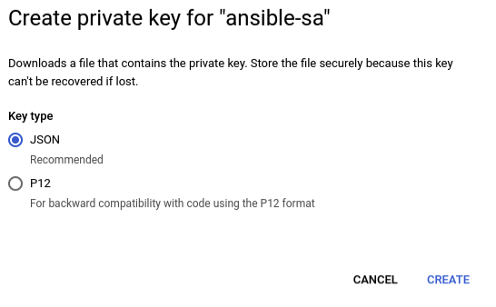

# IMAGE QUALITY ASSESSMENT APPLICATION (IQA) FROM NARROW-BANDING-IMAGING (NBI) ENDOSCOPY CAMERAS DEPLOYED ON K8S
This repository serve as the final project for Module 1 of the Machine Learning Engineer (MLE) Course

## Introduction
Gastrointestinal diseases have a significant impact on human well-being, and among them, gastrointestinal tumors have particularly high rates of occurrence and death. Besides traditional endoscopy, with the advancements in technology, endoscopic techniques nowadays such as the Narrow-banding-imaging (NBI) technique play a fundamental role in the quality of life for individuals by providing numerous imaging information for accurate diagnosis of gastrointestinal diseases. Although the amount of image data is abundant, **most of it is substandard due to many external factors, such as motion blur or harsh and unevenly distributed light in the endoscopic environment**. Therefore, based on the characteristics of the gastroscopy environment, we built an **application that applies AI to evaluate image quality from NBI endoscopy cameras, helping to eliminate poor quality images**, thereby shortening the time required for searching the frames that meet standards. After removing images that didn't match the requirements, we also developed an **additional feature to assist physicians in labelling areas that showed signs of stomach damage**. This allowed us to collect a large amount of data about the areas that showed signs of damage, which we could then **utilize to train an AI model to recognize those signs** automatically.

## Architecture overview

The application is built based on the following technologies:
* **Model**: The **Resnet18** model with pretrained weights from ImageNet dataset is utilized for finetuning with our own dataset for IQA module.
* **Web API**: The backend is built based on Flask, which is a lightweight and flexible web framework, in terms of frontend, we use HTML, CSS with JavaScript. About the database, we utilize object storage namely Minio, mounted to the Filestore storage from Google Cloud Storage (GCP), which completely decouples from the web server, allowing flexibility and scalability.
* **Containerization**: The application is containerized using Docker, which allows for easy deployment and scalability.
* **Deployment**: The model is deployed on Google Kubernetes Engine (GKE), a managed environment for deploying, managing, and scaling containerized applications using Kubernetes. The GKE cluster is provisioned using Terraform, an infrastructure as code tool.
* **Monitoring**: Prometheus, an open-source monitoring and alerting toolkit, along with Grafana, a popular visualization tool, are used to monitor the deployed application and gather performance metrics.
* **CI/CD Pipeline**: The project includes a CI/CD pipeline implemented with Jenkins. Jenkins is installed on Google Compute Engine (GCE) using Ansible to automate image pushes to Docker Hub and streamline the model deployment process on GKE.

## Demo

### Web API


### Monitoring in Grafana


## Run code in your local machine
### Apply docker compose
```shell
docker compose -f docker-compose.yaml up -d
```
### Access the Web API
You can access the Web and Minio UI through port 6789 and 9000 respectively:
* Web UI: `localhost:6789`
* Minio: `localhost:9000`

## Deploy to GCP
### Install Gcloud Related Packages and Setup Project
* [**Install gcloud CLI**](https://cloud.google.com/sdk/docs/install#deb)
* **Install gke-gcloud-auth-plugin**
  ```
  sudo apt-get install google-cloud-cli-gke-gcloud-auth-plugin
  ```

* **Setup Gcloud Project**
  - Authorizes gcloud and other SDK tools to access Google Cloud and setup configuration
    ```
    gcloud init
    ```
  - Login to GCP
    ```
    gcloud auth application-default login
    ```
### Deploy application to GKE cluster
#### Create GKE cluster using Terraform
* [Install the gcloud CLI](https://developer.hashicorp.com/terraform/tutorials/aws-get-started/install-cli)
* Create a GKE cluster using **Terraform** by the following commands:
```shell
cd iac/terraform
terraform init
terraform plan
terraform apply
```

After a while, we should see this if the cluster and filestore storage are successfully created:


* Update the Filestore storage IP address in `helm/datalake/values.yaml` file


#### Run API in GKE Cluster
* Connect to the cluster using `gcloud` command.


* Enable the Filestore CSI driver
```shell
gcloud container clusters update YOUR_CLUSTER_NAME --update-addons=GcpFilestoreCsiDriver=ENABLED --zone=YOUR_DEFINED_ZONE
```

* Deploy **NGINX-ingress**:
```shell
helm upgrade --install nginx-ingress helm/nginx-ingress
```

* [Install helmfile](https://github.com/helmfile/helmfile/releases)

* Deploy all three main components: **iqa-ingress**, **iqa-datalake**, **iqa-app** by these commands:
```shell
helmfile init
helmfile apply -f helmchart.yaml
```

* Get External IP of NGINX-ingress:
```shell
kubectl get svc
```


* Adding the `NGINX-ingress` External IP `NGINX_EXTERNAL_IP iqa.system.com` above to the `/etc/hosts` file:
```shell
sudo nano /etc/hosts
```


* Now you can access the IQA app UI by these domains: `iqa.system.com`


* You can also access the Minio UI through `localhost:9091` by this command:
```shell
kubectl port-forward svc/iqa-datalake 9091:9090
```

To access the Minio UI, you need the username and password:
* Username: **minio_access_key**
* Password: **minio_secret_key**


All the images and their label information are stored in the `userData` bucket


### CI/CD Jenkins in GCE
#### Create a Compute Instance using Ansible
To be able to execute the CI/CD pipeline using **Jenkins**, we need to create a Virtual Machine (VM) instance and install jenkins on it using **Ansible**:
* Create a new service account with [Compute Admin](https://cloud.google.com/compute/docs/access/iam#compute.admin) role. In this project, the service account is named `ansible-sa`.

* Navigate to **Service accounts** section, select action **Manage keys**.


* Create new key of the created service account and download it as JSON file.


* Save the downloaded JSON key in `iac/ansible/secrets`.

* Update the `service_account_file` field in `ansible/playbooks/create_compute_instance.yml` with your new path to the new JSON key.

* Install ansible on your local machine
```shell
pip install ansible==8.3.0
pip install requests==2.31.0
pip install google-auth==2.28.1
```

* Create a VM instance
```shell
cd ansible/deploy_jenkins
ansible-playbook create_compute_engine.yaml
```
After a while, we should see this if the VM instance is successfully created (***iqa-vm-instance***)


Then, we need to change the IP address in the `/iac/ansible/inventory` file with the external IP address of the created VM instance


* Install jenkins
```shell
ansible-playbook -i ../inventory deploy_jenkins.yaml
```
#### Configure Jenkins
* **Connect to Jenkins UI**
  - Checking Jenkins installed successfully on GCE
    - Access the GCE instance
      ```shell
      ssh YOUR_USERNAME@INSTANCE_EXTERNAL_IP -i PATH_TO_PRIVATE_SSH_KEY
      ```
    - Verify if Jenkins is running in the Compute Engine instance
      ```shell
      sudo chmod 777 /var/run/docker.sock
      docker ps
      ```
      
  - Access Jenkins UI via `INSTANCE_EXTERNAL_IP:8081`.
  - Follow the instruction to log in into Jenkins.
  - The password can be retrieved by
    ```shell
    # inside GCE instance
    docker exec -it jenkins bash
    cat /var/jenkins_home/secrets/initialAdminPassword
    ```
  - Install required plugins

    

* **Connect Jenkins to GitHub Repo**
  - Add Jenkins to Repo Webhook
    - Payload URL would `http://INSTANCE_EXTERNAL_IP:8081/github-webhook/`

    
    - Event Trigger can be set to: *Pushes* and *Pull Requests*
  - Add GitHub Repo to Jenkins
    - Create new Multibranch Item in Jenkins
    - Create a new [Personal Access Token](https://github.com/settings/tokens]). In this project we will generate a **classic** token.
    
    - Connect Repo to Jenkins
      - Add credentials with your Github `username` and password is just-created `Personal Access Token`
      - Copy the URL to your Github repo.
      - Click `Validate` to see whether Jenkins successfully connect to your Github repo or not.
    

* **Add DockerHub Token to Jenkins Credential**
  - Create a new DockerHub Token
  - Add the token to Jenkins' Credentials
    - *Note*: ID must be `dockerhub` to match the `registryCredential` in `Jenkinsfile`.
  

* **Setup Cloud Connection**
  - Create `clusterrolebinding`
    ```shell
    kubectl create clusterrolebinding model-serving-admin-binding \
      --clusterrole=admin \
      --serviceaccount=default:default \
      --namespace=default

    kubectl create clusterrolebinding anonymous-admin-binding \
      --clusterrole=admin \
      --user=system:anonymous \
      --namespace=default
    ```
  - Grant permissions for Jenkins to access the GCP Filestore storage
    ```shell
    kubectl apply -f k8s/rbac
    ```
  - Configure clouds at `http://INSTANCE_EXTERNAL_IP:8081/manage/configureClouds/`
    - Get `Kubernetes URL` and `Kubernetes server certificate key` by running the following in terminal of your local machine (***I use Minikf in my local machine***).
      ```shell
      cat ~/minikf-kubeconfig
      ```
      - `Kubernetes URL` is `server`
      - `Kubernetes server certificate key` is `certificate-authority-data`

      

    

* **Build**
  - Whenever there are changes merged to `main`, the **Deploy** pipeline will run, build and push the latest image to DockerHub.
  - After that, the pipeline will use **Helm** to pull and deploy the latest image in GKE cluster automatically including all three main components:
    - **IQA ingress rules**
    - **IQA Datalake**
    - **IQA App**

  

## Monitoring and Alert System
### Monitoring
- Create Custom Resource Definitions (CRDs) for **Prometheus Operator**
  ```shell
  kubectl apply --server-side -f k8s/observable/prometheus-operator-crd
  ```
- Create **Node exporter, Cadvisor, Prometheus, Prometheus Operator and Grafana**
  ```shell
  kubectl apply -R -f k8s/observable/monitoring
  ```
- To check if everything works fine, you can run this commands:
  ```shell
  kubectl get pod --all-namespaces
  ```
  If successful, we should see this message:

  
- Adding the `NGINX-ingress` External IP `NGINX_EXTERNAL_IP iqa.monitoring.com` to the `/etc/hosts` file and you can visit the Grafana UI through `iqa.monitoring.com`

  
- To access the Grafana UI, you need the username and password:
  * Username: **admin**
  * Password: **devops123**

  
- To check everything connects to `Prometheus` successfully:
  ```shell
  kubectl port-forward svc/prometheus-operated 9090:9090 -n monitoring
  ```
  Access `Prometheus` UI through `localhost:9090`, at the `http://localhost:9090/targets?search=`, you shoud see all target are ready:
  
### AlertManager
* **Config Slack notifications**
  - Create a channel name `alerts`.
  - Go to `https://api.slack.com/apps` and create an app and the corresspond workspace.

    
  - Enable the `Incoming Webhooks`, copy the `Webhook URL` and replace the `api_url` attribute in the `k8s/     alertmanager/0-config.yaml` file

    
* **Apply AlertManager**
  - To create an `AlertManager` instance in kubernetes, run this command:
    ```shell
    kubectl apply -f k8s/alertmanager
    ```
  - After a few minutes, at the `http://localhost:9090/alerts?search=`, you should see:
    

## TODO
- Deploy Log and Traces Storage services such as Elasticsearch and Jaeger.
